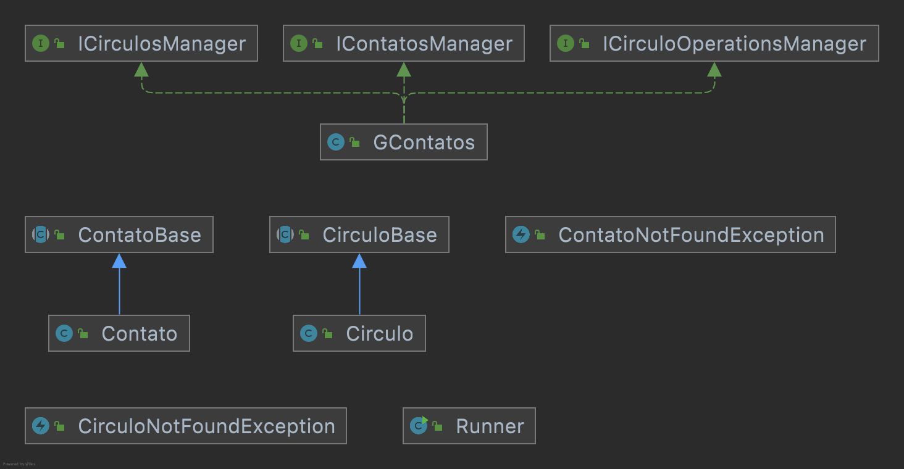

# Círculos
Neste trabalho temos como objetivo implementar um conjunto de classes de modo que elas nos forneçam as funcionalidades 
similares ao conceito de círculos e contatos existentes no finado Google+

- [Requisitos](#requisitos)
- [Diagrama](#diagrama)
- [Exemplo de execução](#exemplo-de-execução)
- [Relatório de Entrega](#relatório-de-entrega)


## Requisitos

### Contato
- Adicionar um contato
  - Cada contato possui um identificador único (String) e um email
  - Jamais deve ser possível adicionar um contato com o identificador de um contato já adicionado
- Remover um contato
  - Ao informar o identificador único, o contato deve ser removido caso ele tenha sido previamente adicionado
- Atualizar email do contato
  - Deve ser possível atualizar o email do contato ao informar o seu identificador e o novo email
- Buscar um contato
  - O usuário deve ser capaz de recuperar um contato ao procurá-lo utilizando o identificador do contato 
se o contato houver sido previamente cadastrado
- Número de contatos
  - O usuário deve ser capaz de consultar o número de contatos cadastrados no sistema 
- Favoritos
  - Deve ser possível favoritar um contato ao informar o seu identificador
  - Deve ser possível desfavoritar um contato ao informar o seu identificador
  - Deve ser possível listar todos os contatos favoritos
  - Deve ser possível verificar se um contato é um dos favoritos ao informar o seu identificador

### Círculos
- Adicionar um círculo
    - Cada círculo possui um identificador único (String) e um limite de armazenamento de contatos
    - Jamais deve ser possível adicionar um círculo com o identificador de um círculo já adicionado
- Remover um círculo
    - Ao informar o identificador único, o círculo deve ser removido caso ele tenha sido previamente adicionado
- Atualizar o limite de armazenamento de um círculo
    - Deve ser possível atualizar o limite de armazenamento de um círculo ao informar o seu identificador 
e o novo valor do limite de armazenamento
- Buscar um círculos
    - O usuário deve ser capaz de recuperar um círculo ao procurá-lo utilizando o identificador do círculo 
      se o círculo houver sido previamente cadastrado
    - O usuário deve ser capaz de recuperar todos os círculos cadastrados
- Número de círculos
    - O usuário deve ser capaz de consultar o número de círculos cadastrados no sistema
 
### Círculos & Contatos

- Adicionar contato em um círculo
  - Só deve ser possível adicionar um contato em um círculo que ainda possui espaço de armazenamento
  - Se o contato informado não existir, uma exceção (ContatoNotFoundException) deve ser lançada
  - Se o círculo informado não existir, uma exceção (CirculoNotFoundException) deve ser lançada
- Remover um contato de um círculo
  - Deve ser possível remover de um círculo um contato previamente adicionado
  - Se o contato informado não existir, uma exceção (ContatoNotFoundException) deve ser lançada
  - Se o círculo informado não existir, uma exceção (CirculoNotFoundException) deve ser lançada
- Listar todos os círculos os quais um contato pertence
  - Se o contato informado não existir, uma exceção (ContatoNotFoundException) deve ser lançada
- Círculos em comum
  - O Sistema deve retornar a lista de círculos que dois contatos possuem em comum ordenada pelo identidicador dos círculos
  - Se um dos contatos informados não existir, uma exceção (ContatoNotFoundException) deve ser lançada
  

## Diagrama



## Exemplo de execução 

```java
    GContatos gcont = new GContatos();

    gcont.createCircle(FAMILIA, 3);
    gcont.createCircle(AMIGOS, 2);
    gcont.createCircle(TRABALHO, 3);
    System.out.println(gcont.getAllCircles()); //[amigos, familia, trabalho]

    gcont.createContact(JAMES, JAMES_EMAIL);
    gcont.createContact(MARIO, MARIO_EMAIL);
    gcont.createContact(JOSE, JOSE_EMAIL);
    gcont.createContact(ANA, ANA_EMAIL);
    gcont.createContact(JOAQUIM, JOAQUIM_EMAIL);
    System.out.println(gcont.getAllContacts()); //[ana, james, joaquim, jose, mario]

    gcont.tie(MARIO, FAMILIA);
    System.out.println(gcont.getCircles(MARIO)); //[familia]

    gcont.tie(JAMES, TRABALHO);
    gcont.tie(JOAQUIM, TRABALHO);
    gcont.tie(ANA, TRABALHO);
    System.out.println(gcont.getContacts(TRABALHO)); //[ana, james, joaquim]

    gcont.tie(JAMES, AMIGOS);
    gcont.tie(MARIO, AMIGOS);
    System.out.println(gcont.getContacts(AMIGOS)); //[james, mario]

    System.out.println(gcont.getCommomCircle(JAMES, ANA)); //[trabalho]
    System.out.println(gcont.getCommomCircle(JAMES, JOSE)); //[]
    System.out.println(gcont.getCommomCircle(JAMES, MARIO));//[amigos]        
```

## Relatório de Entrega

Não esqueça de preencher o seguinte formulário [Link para formulário](https://forms.gle/1UfbAWfnT8aF46Kv8) ao completar a atividade.
